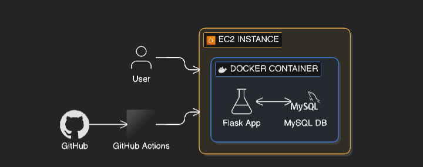

# 🚀 DevOps Flask App (Two-Tier Architecture)

## 📌 Project Overview

This project demonstrates a complete DevOps workflow by deploying a containerized Flask application with a MySQL database using Docker, CI/CD, and AWS EC2.

---

## 🧱 Architecture

* Flask (Backend)
* MySQL (Database)
* Docker & Docker Compose
* GitHub Actions (CI/CD)
* AWS EC2 (Deployment)

---

## ⚙️ Tech Stack

* Python (Flask)
* Docker
* Docker Compose
* GitHub Actions
* AWS EC2

---

## 🚀 Features

* Containerized application using Docker
* Multi-container setup with Docker Compose
* CI pipeline with GitHub Actions
* Automated deployment (coming next)
* Health check endpoint

---

## 📂 Project Structure

```
.
├── app.py
├── requirements.txt
├── Dockerfile
├── docker-compose.yml
└── .github/workflows/ci.yml
```

---

## 🛠️ Setup Instructions

### 1. Clone repository

```
git clone https://github.com/YOUR_USERNAME/devops-flask-app.git
cd devops-flask-app
```

### 2. Run with Docker Compose

```
docker compose up --build
```

### 3. Access application

```
http://localhost:5000
```

---

## 🔄 CI/CD Pipeline

* Trigger: Push to main branch
* Build Docker image
* Run container
* Perform health check

---

## 🌐 Deployment

* Deployed on AWS EC2
* Accessible via public IP

---

## 🧠 Key Learnings

* Containerization using Docker
* Multi-service architecture
* CI/CD pipeline implementation
* Cloud deployment using AWS

---

## 🔥 Future Improvements

* Terraform for infrastructure automation
* Nginx reverse proxy
* HTTPS setup
* Kubernetes deployment

---

## 🏗️ Architecture Diagram


